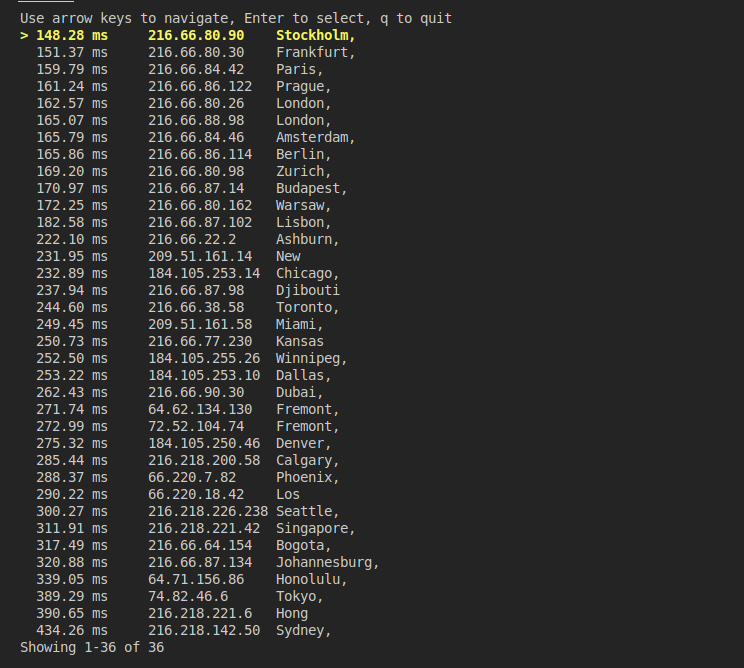

# ./auto-tunnel-broker.sh

Automatically setup ipv6 on your server using tunnelbroker.net services.




## How to use:

```
$ bash <(curl -s https://raw.githubusercontent.com/sahandevs/auto-tunnel-broker.sh/master/auto-tunnel-broker.sh) \
  "Username" "Password"
```